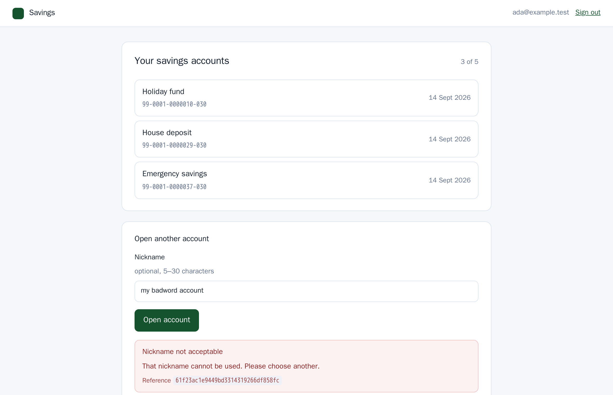
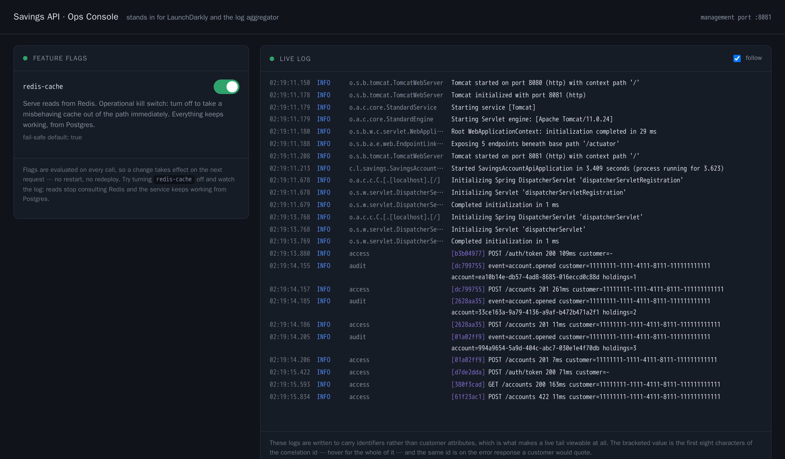

# Savings Account API

A savings-account API in Spring Boot, with a React front end and an operations console.
Everything runs from one command.

## Run it

```bash
docker compose up --build
```

Nothing else is needed — no JDK, no Node. First build takes a few minutes.

| | |
|---|---|
| Customer app | <http://localhost:3000> |
| API | <http://localhost:8080> |
| Management (health, flags, log tail) | <http://localhost:8081/actuator> |
| Ops console | <http://localhost:8082> |

To start over — the Postgres volume outlives `docker compose down`, so accounts opened
while trying things out stay opened:

```bash
docker compose down -v && docker compose up --build
```

Demo customers, all with password `demo-password`:
`ada@example.test` · `grace@example.test` · `alan@example.test` (due diligence
incomplete — account opening is correctly refused).



## Worth trying

| | |
|---|---|
| Open five accounts | the sixth is refused with `409` |
| Nickname `my badword account` | `422`, and the nickname is not echoed back |
| Open an account as Alan | `403`; signing in succeeds, opening is refused, and the reason is audited but not disclosed to the caller |
| `docker compose stop postgres` | `503` in 3s with a reference, not a hang; recovers on its own |
| `docker compose stop redis` | nothing breaks — the cache is never on the correctness path |
| Send the same request twice with an `Idempotency-Key` | the second replays the original account; no second account is opened |
| Toggle `redis-cache` in the ops console | takes effect on the next request, no restart |

Every error carries a **reference**. Search for it in the ops console log and you will
find the request that produced it.



## What the brief asked for

| Requirement | Where | Proved by |
|---|---|---|
| Create a savings account | `AccountController.open` | `AccountApiTest` |
| Get the savings account | `AccountController.get` | `AccountApiTest` |
| Account number autogenerated | `NzAccountNumberFormat`, NZ format with modulus-11 check | `NzAccountNumberFormatTest` |
| Id autogenerated | `AccountWriter` | `AccountApiTest` |
| Customer name (mandatory) | taken from the **verified customer record**, not the request body — see below | `AccountApiTest` |
| Nickname (optional) | `OpenAccountRequest` | `AccountApiTest` |
| Nickname 5–30 characters | `@Size`, plus a `CHECK` constraint | `AccountApiTest` |
| No more than 5 accounts | enforced **in the schema**, not in Java | `AccountCapConcurrencyTest` |
| Nickname checked against a blocked list | `ResourceOffensiveNicknameChecker` | `OffensiveNicknameCheckerTest` |
| Saved in one Postgres table | `V1__account.sql` | — |
| Request body validated | Bean Validation → RFC 7807 | `AccountApiTest` |
| *Optional:* database unavailable | fast fail, `503` problem document | verified by stopping the container |
| *Optional:* cache the GET | `CacheConfig` | `CacheBehaviourTest`, `CacheOutageTest` |
| *Optional:* useful tests | 75 backend, 3 front end | `./gradlew test`, `npm test` |
| Built with Gradle or Maven | Gradle | — |

**Two places this reads against the brief, deliberately.** The customer's *name* and
*id* both come from the verified customer record and the token, never from the request
body — under AML/CFT an account is opened for a customer whose identity the bank has
already established, so a name asserted by the caller would be an unverified claim
written into a banking record. The account still carries a mandatory customer name; it
is simply guaranteed more firmly than `@NotBlank` on a body field. Reasoning in
[DECISIONS.md](DECISIONS.md).

## Architecture

```
browser ──► frontend (nginx)  ──┐
                                ├─► backend :8080  ──► postgres
ops console (nginx) ────────────┘         :8081         redis
```

nginx serves each app and proxies its API calls on the same origin, so there is no CORS
configuration anywhere. It also mints the correlation id, because that is the gateway's
job. Operational surfaces live on their own port.

Three integration points are behind interfaces, because in a real bank none of them are
local: **account number allocation** (the core banking platform), the **customer
directory** (the customer master), and **feature flags** (LaunchDarkly). Each ships with
a demo adapter and a note on what the real one needs.

## Tests

```bash
cd backend && ./gradlew test     # 75, against real Postgres and Redis via Testcontainers
cd frontend && npm test          # 3, covering the optimistic update
```

What each test is for, and why it is written the way it is:
[DECISIONS.md](DECISIONS.md#testing).

## Why things are the way they are

[DECISIONS.md](DECISIONS.md) — including what was deliberately left out, and where this
differs from a real bank.
